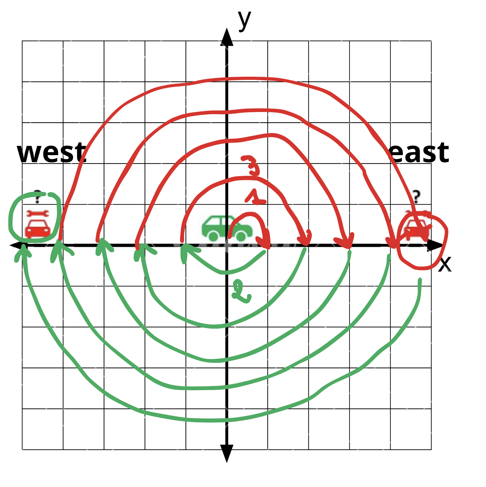

## Task 2: Algorithmic

### Python:

```python
for i in range(1, 101):
    output = ""
    if i % 3 == 0:
        output += "Hello"
    if i % 5 == 0:
        output += "World"
    if i % 7 == 0:
        output += "Yoo"
    print(output if output else i, end=", ")
```

### C#:

```c#

using System;

class Program
{
    static void Main()
    {
        for (int i = 1; i <= 100; i++)
        {
            string output = "";
            if (i % 3 == 0)
            {
                output += "Hello";
            }
            if (i % 5 == 0)
            {
                output += "World";
            }
            if (i % 7 == 0)
            {
                output += "Yoo";
            }
            if (string.IsNullOrEmpty(output))
            {
                output = i.ToString();
            }
            Console.Write(output);
            if (i < 100)
            {
                Console.Write(", ");
            }
        }
    }
}
```

## Task 3: Logic

### Finding our Friend's Car on an Infinite Bidirectional Highway

#### Spiral Search Algorithm



**Starting Point:** Begin at position 0 on the highway.

**Search Pattern:**

- Drive 1 mile east, then return to 0.
- Drive 1 mile west, then return to 0.
- Drive 2 miles east, then return to 0.
- Drive 2 miles west, then return to 0.
- Continue this pattern, increasing the distance by 1 mile each time and alternating directions.

**Key Points:**

- **Completeness:** The algorithm guarantees finding our friend's car because it systematically expands the search area in both directions.
- **Efficiency:** Each step covers a progressively wider range, ensuring no location is left unchecked.
- **Guarantee:** Given the infinite nature of the highway and unlimited fuel assumption, the car will be found within a finite number of steps.
- **Balanced Coverage:** Alternating directions ensures that we cover both sides of the highway evenly. This prevents bias towards one direction and increases the likelihood of finding the target (friend's car) sooner if it is closer in one direction.

This is a [Next.js](https://nextjs.org/) project bootstrapped with [`create-next-app`](https://github.com/vercel/next.js/tree/canary/packages/create-next-app).

## Getting Started

First, run the development server:

```bash
npm run dev
# or
yarn dev
# or
pnpm dev
# or
bun dev
```

Open [http://localhost:3000](http://localhost:3000) with your browser to see the result.

You can start editing the page by modifying `pages/index.js`. The page auto-updates as you edit the file.

[API routes](https://nextjs.org/docs/api-routes/introduction) can be accessed on [http://localhost:3000/api/hello](http://localhost:3000/api/hello). This endpoint can be edited in `pages/api/hello.js`.

The `pages/api` directory is mapped to `/api/*`. Files in this directory are treated as [API routes](https://nextjs.org/docs/api-routes/introduction) instead of React pages.

This project uses [`next/font`](https://nextjs.org/docs/basic-features/font-optimization) to automatically optimize and load Inter, a custom Google Font.

## Learn More

To learn more about Next.js, take a look at the following resources:

- [Next.js Documentation](https://nextjs.org/docs) - learn about Next.js features and API.
- [Learn Next.js](https://nextjs.org/learn) - an interactive Next.js tutorial.

You can check out [the Next.js GitHub repository](https://github.com/vercel/next.js/) - your feedback and contributions are welcome!

## Deploy on Vercel

The easiest way to deploy your Next.js app is to use the [Vercel Platform](https://vercel.com/new?utm_medium=default-template&filter=next.js&utm_source=create-next-app&utm_campaign=create-next-app-readme) from the creators of Next.js.

Check out our [Next.js deployment documentation](https://nextjs.org/docs/deployment) for more details.
